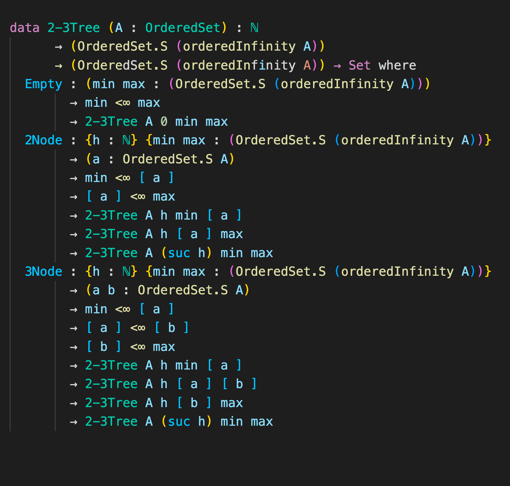
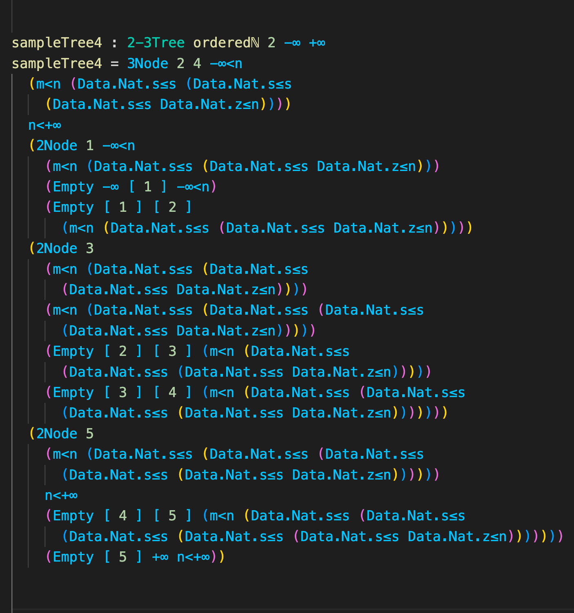
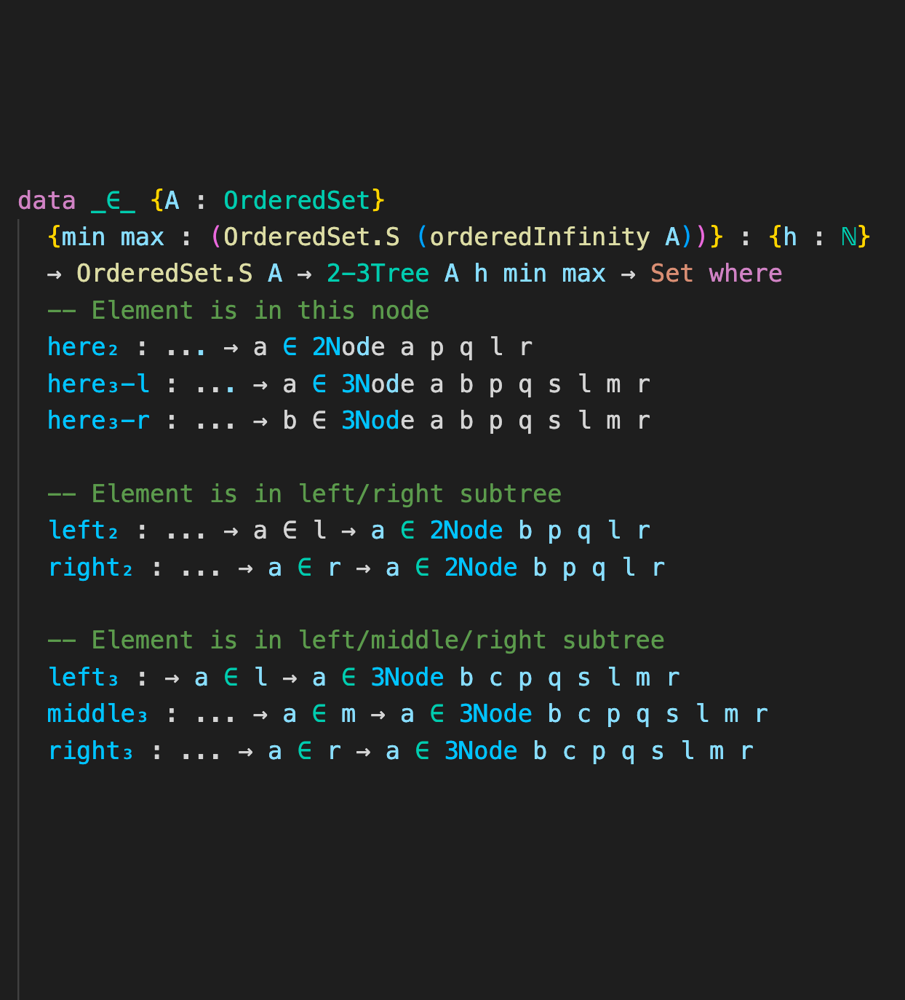
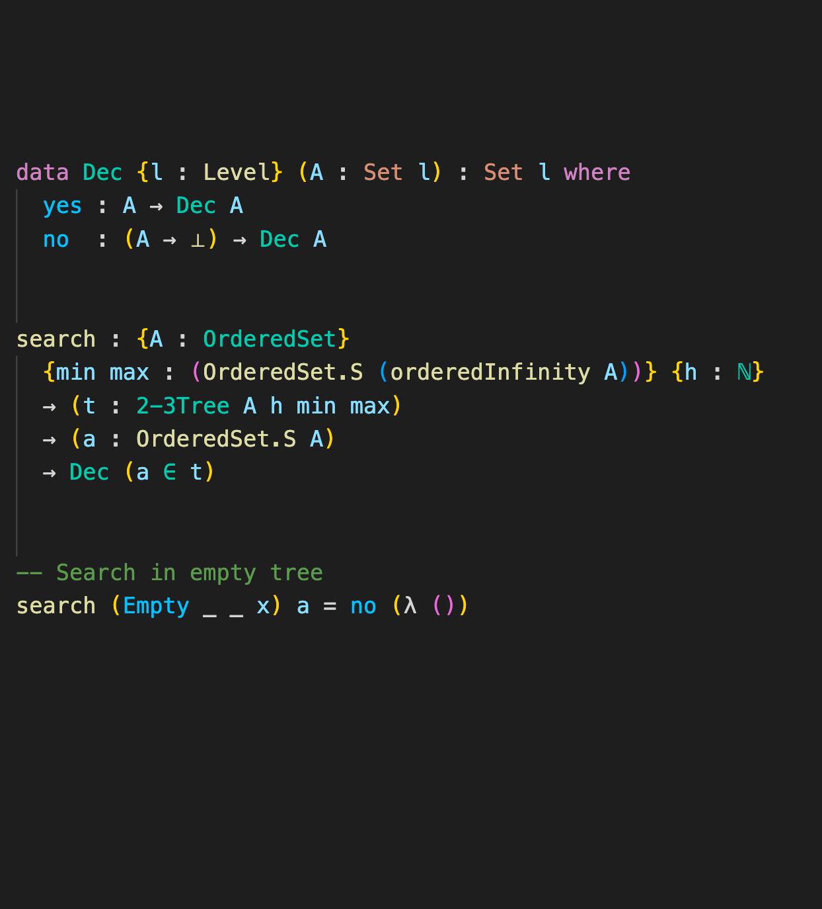
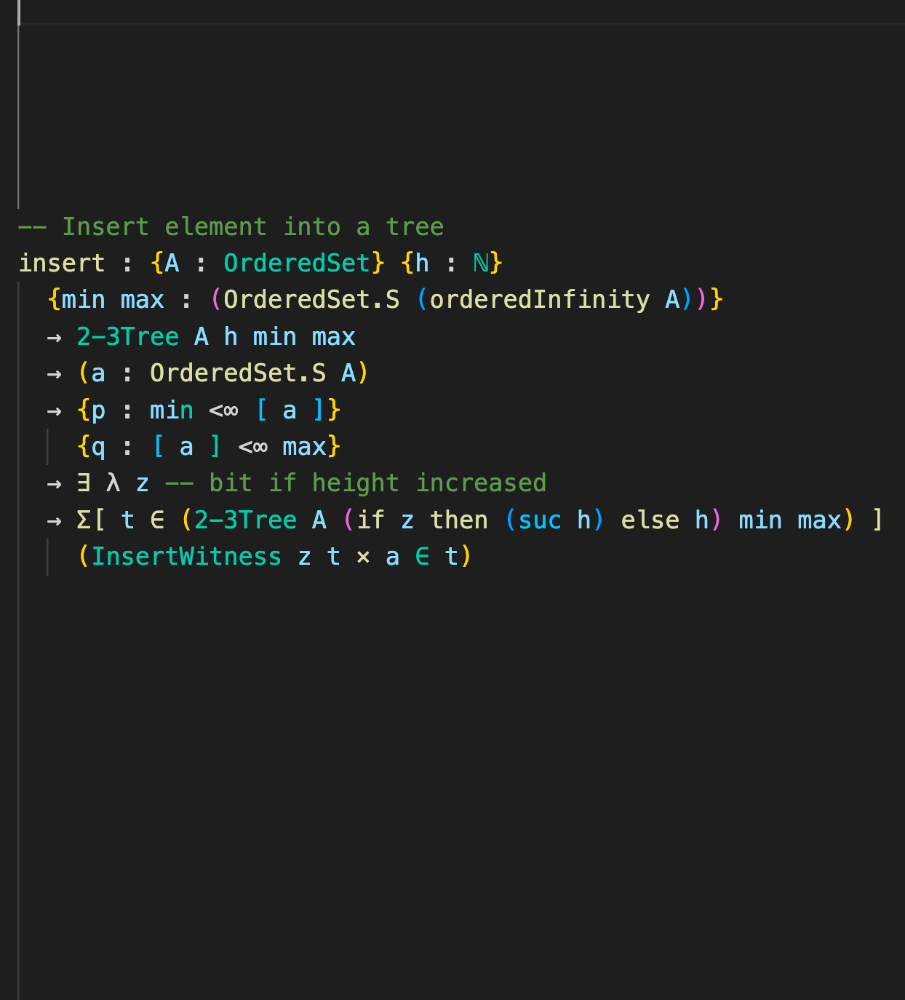

<!-- _class: lead -->

# 2–3 trees

Vid Drobnič, Matej Marinko

---

# 2-3 Trees

TODO slikce / risanje po tabli

---

# 2-3 Trees

- INF set
- TODO dokazi so zraven

---

# 2-3 Trees

---

# Search

- Relation $a \in t$

---

# Search

- Relation $a \in t$
- Decidable type
- Search function
- Lemmas to eliminate impossible cases

---

# Insert

- Proofs that $a$ lies between bounds
- Height of the tree can increase
- Defined recursively
- Some cases cannot happen

---

# Obstacles Encountered

- Overly complicated Tree definition at the beginning led us to rewrite code using $\leqslant$ instead of $<$.
- Inserting _might_ increase the height of the tree.
- `insert` cannot return certain values.
- `insert` also returns a proof $a \in t$.

---

# What Remains to be Done

- Write wrapper for `insert` function.
- Restructure the code to use Agda modules.
